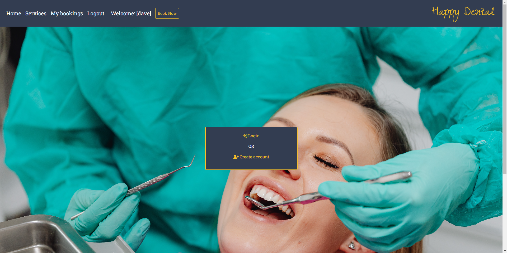

<h2>Happy Dental - Dental Booking App</h2>

- [**UX (User Experience)**](#ux-user-experience)
  - [**User Stories**](#user-stories)
- [**Design and Site Structure**](#design-structure)
  - [**Functional Structure**](#functional-structure)
  - [**Wireframes**](#wireframes)
- [**Features**](#features)
  - [**Responsive Design**](#responsive-design)
- [**Technologies**](#technologies)
  - [**Languages**](#languages)
  - [**Frameworks and Libraries**](#frameworks)
  - [**Tools**](#tools)
- [**Testing**](#testing)
- [**Deployment**](#deployment)
- [**Credits**](#credits)
  - [**Code**](#code)
  - [**Content**](#content)
  - [**Media**](#media)
  - [**Inspiration**](#inspiration)
  - [**Acknowledgments**](#acknowledgments)

  
# Portfolio Project 4 - Happy Dental reservation system  

The deployed [HAPPYDENTAL]() app.

The [GitHub repository](https://github.com/dsouths/happydentalapp)

## Project goals

This is my 4th project under the Code Institute Diploma in Full Stack Development program.
This website is a fictional dental practice called HAPPYDENTAL. It is designed to be responsive and accessible on a variety of devices for the ease of use of the site by potential users.

## UX (User Experience)

### User stories

#### First time visitor goals

As a first time visitor, I want:
* understand the main purpose of the site,
* able to easily navigate throughout the site,
* able to register a user account to access all content without restrictions,
* able to reserve a day and time for a treatment with a chosen dentist, view booking details and make changes to created bookings and delete my bookings,
* able to log out of my user account.
       
        
#### Returning and frequent user goals

As a returning user, I want:
* to sign in to my user account,
* to book a treatment with chosen dentist, 
* to view my booking details, 
* to edit my booking details or delete them.
* to sign out of my account to keep my account safe.

#### Site Administrator goals
As a Site Administrator I would like to be able to create, view, edit and delete booking data.    

[Back to the top](#table-of-contents)

#### Agile tools

I used a [Kanban board](https://github.com/users/dsouths/projects/3/views/1) for the development of this project, which made it possible to break down the project execution into subtasks and make it easier to complete and track project progress.  This is located in the GitHub Projects section

#### Design and Site Structure

The site was based on the Gobarber template from the Figma Community site. The look of the site & fonts for the home page were borrowed from the template.
The main page layout can be seen below:

Happy Dental website design template 

 
